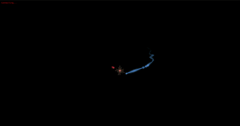

# Beyblade SFX Web Projection

This project is heavily vibe-coded and still in the testing phase.

Web-based SFX projection for [open_beybladex_ar_core](https://github.com/Trafitto/open-beybladex-ar-core). Receives tracking data via WebSocket and renders trails, glow, and impact effects for projector output.


## Setup

1. **Run the [core tracker](https://github.com/Trafitto/open-beybladex-ar-core) with `--web`:**
   ```bash
   cd ../open_beybladex_ar_core
   python main.py -w
   ```

2. **Serve this web app:**
   ```bash
   cd open_beybladex_ar_web
   python -m http.server 8080
   ```

3. **Open in browser:** http://localhost:8080

4. **Fullscreen on projector:** Press F11 or use a second display. Point the browser window to the projector output.

## Query params

- `?flipY=1` - Flip Y axis (for bottom projector projecting upward)
- `?scale=0.85` - Scale the projection (default 1)
- `?offsetX=0.1` / `?offsetY=-0.05` - Shift projection
- `?rotate=5` - Rotate in degrees
- `?calibrate=1` - Start with calibration overlay on

### Calibration

Press **C** to toggle calibration mode. A green circle appears — align it to your stadium rim using the keyboard:

| Key | Action |
|-----|--------|
| Arrows | Move the projection |
| + / - | Scale up / down |
| R / E | Rotate CW / CCW |
| Shift + any | Fine adjustment |

The overlay shows a URL with your current settings. Copy it and use it next time so you don't have to re-calibrate.

## Project structure

| File | Role |
|------|-----|
| `index.html` | Entry point |
| `css/style.css` | Fullscreen canvas, status |
| `js/app.js` | WebSocket client, trail/glow/impact rendering |

## Early demos


